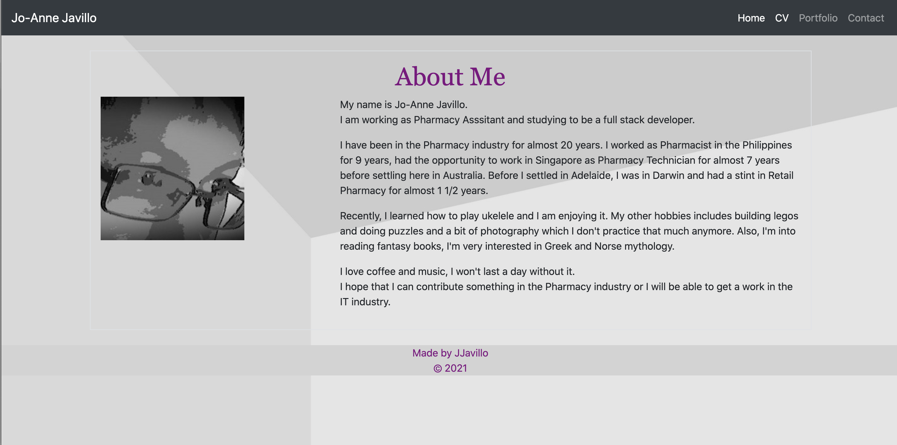

# myPortfolio
---

### Table of Contents
### Overview
### Technologies
### Acceptance Criteria
### Links
### Screenshots of the app
### License
---

## Overview
* This is an updated porfolio of one of my first projects - my bio. 
* This portfolio also features some of the projects that I did
---

## Technologies Use
* Bootstrap
* JS
* CSS
---

## Acceptance Criteria
* It should include projects that I did
* An Updated portfolio
* Resume
* LinkedIn Profile
* All links should be responsive

## Links
* GitHub: [https://github.com/joannejavillo/myPortfolio]
* Deployed Link of Portfolio: [https://joannejavillo.github.io/myPortfolio/]
* LinkedIN: [https://www.linkedin.com/in/jo-anne-javillo-b88103206/]
* Resume: [assets/cv/joannejavillo_CV(SA).pdf]

## Screenshots:

- Main page

