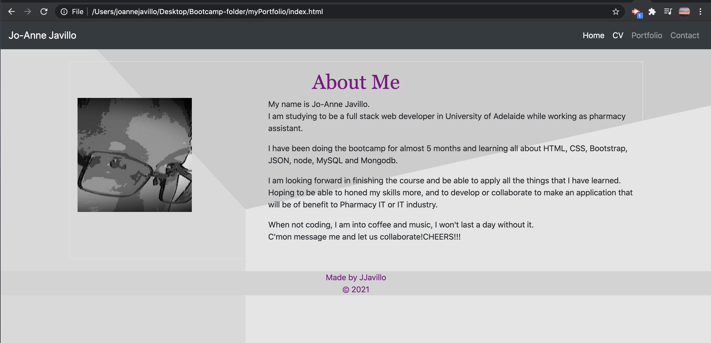
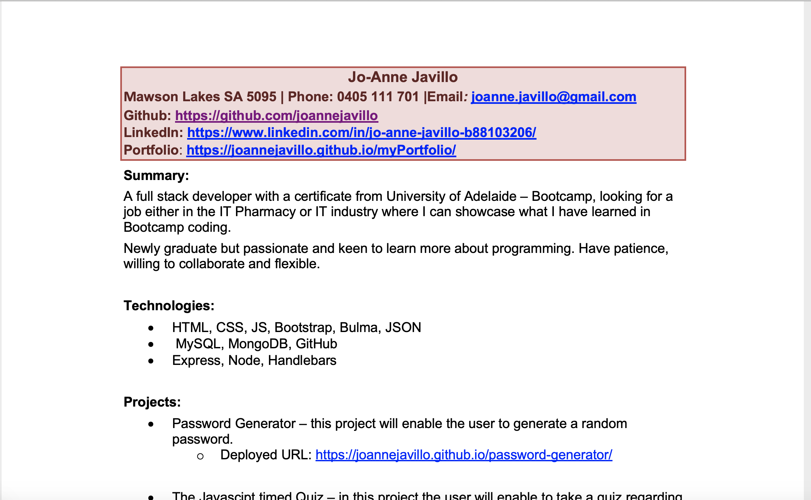
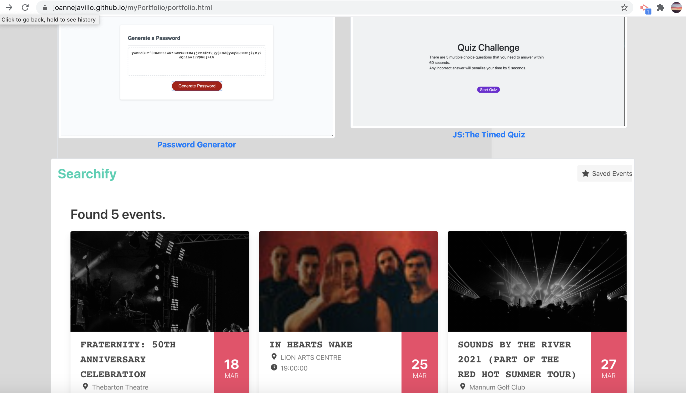
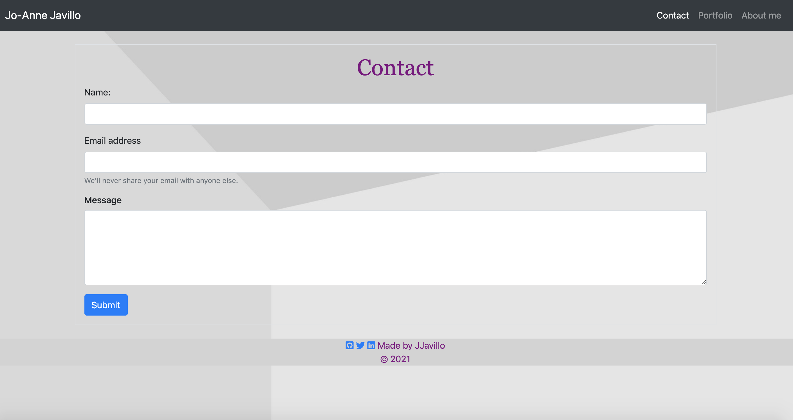

# myPortfolio
---

--- 
## Description
  - [Description](#Description)
  - [Technologies](#Technologies)
  - [Acceptance Criteria](#AcceptanceCriteria)
  - [Links](#Links)
  - [Screenshots](#Screenshots)
  - [License](#License)
  - [Questions](#Questions)
---

## Description
* This is an updated porfolio of one of my first projects - my bio. 
* This portfolio also features some of the projects that I did
---

## Technologies
* Bootstrap
* JS
* CSS
---

## AcceptanceCriteria
* It should include projects that I did
* An Updated portfolio
* Resume
* LinkedIn Profile
* All links should be responsive

## Links
* GitHub: [https://github.com/joannejavillo/myPortfolio]
* Deployed Link of Portfolio: [https://joannejavillo.github.io/myPortfolio/]
* LinkedIN: [https://www.linkedin.com/in/jo-anne-javillo-b88103206/]
* Resume: [./assets/cv/joannejavillo_IT.pdf/]

## Screenshots:

- Main page

- CV

- Portfolio

- Contact
---

## License
* This project is licensed under the terms of MIT License.

## Questions
If you have any questions you can contact me at jo_anne.javillo@outlook.com or you can visit my gitHub page: (https://github.com/joannejavillo)

